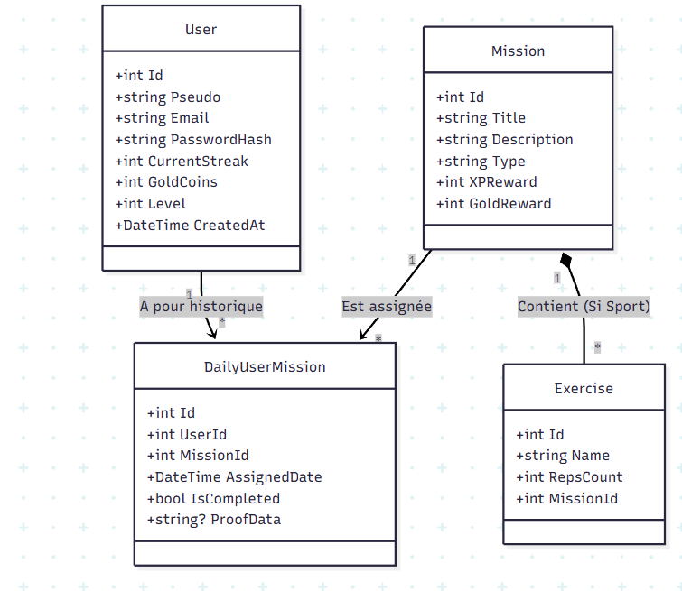

# 🦊 VulpiFit


> **"Le Duolingo du Fitness"** : Transformez votre routine bien-être en un jeu addictif.

## 📖 Présentation du Projet

**VulpiFit** est une application mobile de gamification sportive développée dans le cadre du module **Développement C#.Net (IF 2026)**.

L'objectif est de lutter contre la perte de motivation en appliquant des mécaniques de jeu vidéo à la santé physique. L'utilisateur doit maintenir une **Série (Streak)** en validant quotidiennement trois types de missions : Sport, Nutrition et Activité.

## 🏗️ Architecture Technique

Ce projet respecte une architecture **Client-Serveur** distribuée, séparant strictement la logique métier (Back-end) de l'interface utilisateur (Front-end).


[Image of client server architecture diagram]



### 🔌 Back-end (API & Data)
L'intelligence de l'application réside sur le serveur.
* **Langage :** C# (.NET Core).
* **Framework :** ASP.NET Core Web API.
* **Base de données :** SQL Server.
* **ORM :** Entity Framework Core (Approche *Code First*).
* **Rôle :** Gestion des utilisateurs, validation des missions, calcul de l'XP et persistance des données.

### 📱 Front-end (Client Mobile)
L'interface utilisateur est une application mobile native.
* **Framework :** Flutter (Dart).
* **Plateformes :** Android & iOS.
* **Rôle :** Affichage des missions, navigation, prise de photos et interaction avec l'API via requêtes HTTP (REST).

## ✨ Fonctionnalités Clés

* **Gamification :** Système de niveaux, barres d'expérience (XP) et monnaie virtuelle.
* **Daily Streak :** Algorithme de gestion de série pour encourager la régularité.
* **Missions Dynamiques :**
    * 🏋️ **Sport :** Séries d'exercices interactives.
    * 📸 **Nutrition :** Journal photo des repas.
    * 🧘 **Mental :** bien être mental au quotidien.
* **Récompenses Sonores & Visuelles :** Feedback immédiat pour l'utilisateur (confettis, sons de victoire).

## 🚀 Installation et Lancement

Pour tester le projet complet, vous devez lancer l'API (Back) puis l'Application (Front).

### Prérequis
* .NET SDK 8.0 (ou supérieur)
* SQL Server (LocalDB ou Docker)
* Flutter SDK
* Visual Studio 2022 & VS Code

### 1. Démarrer l'API (Back-end)
```bash
cd VulpiFit.API
# Restauration des dépendances et création de la BDD
dotnet ef database update
# Lancement du serveur
dotnet run
